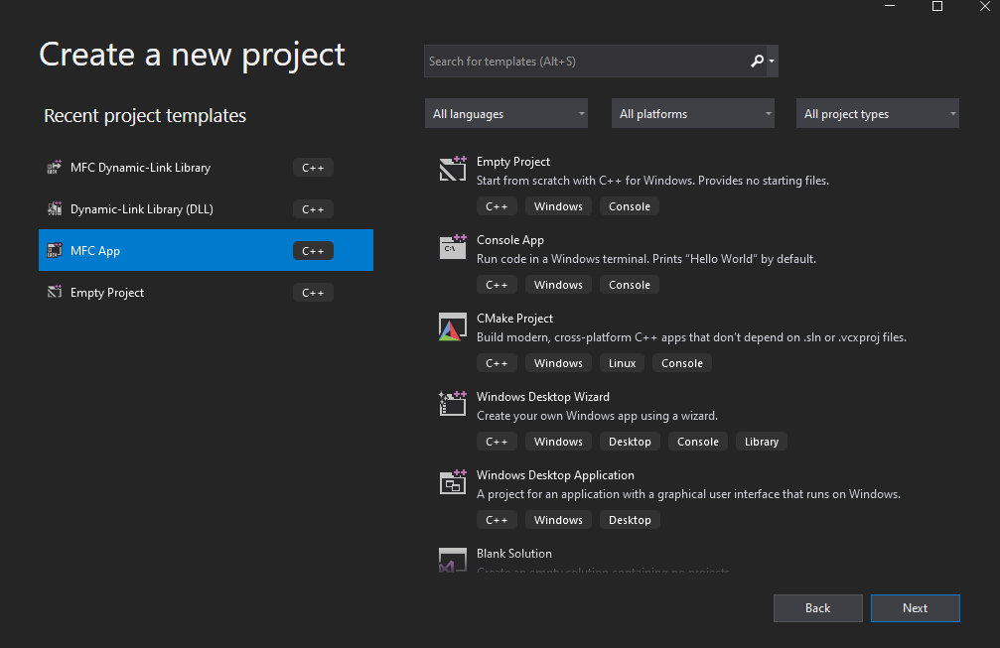
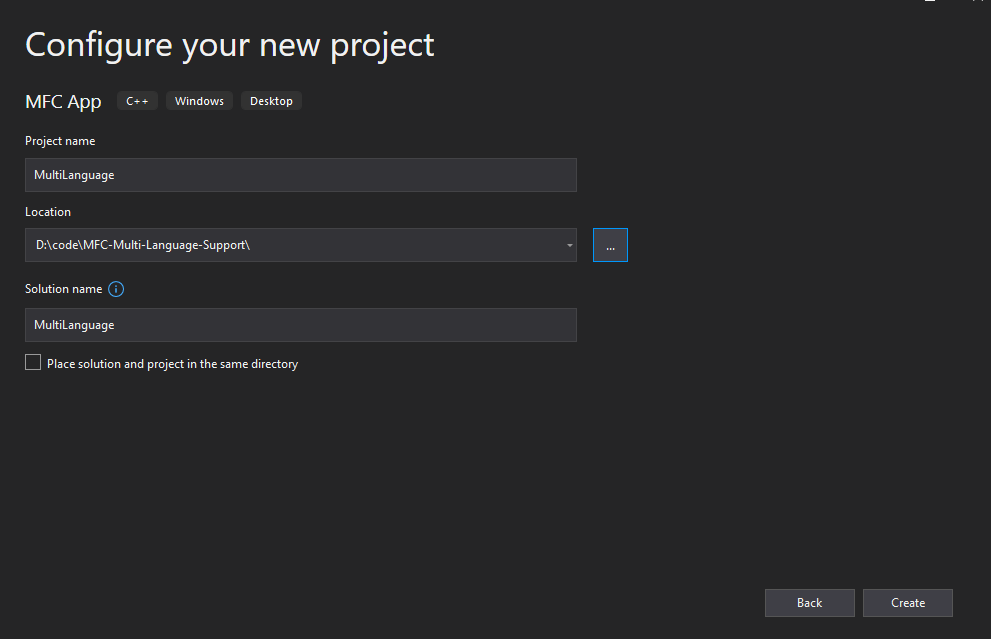
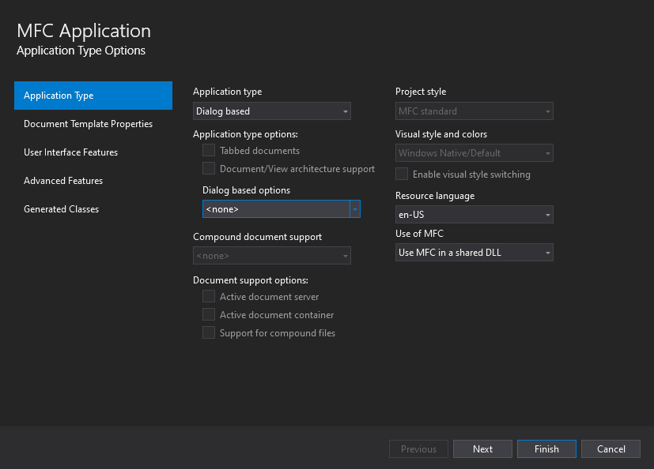
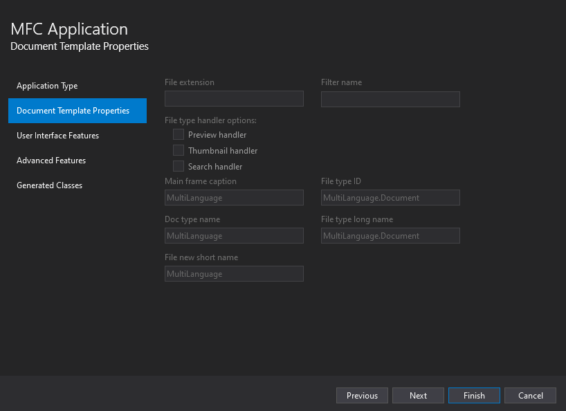
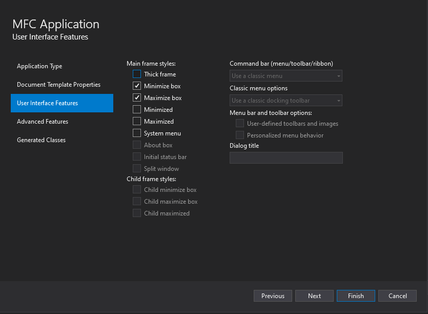
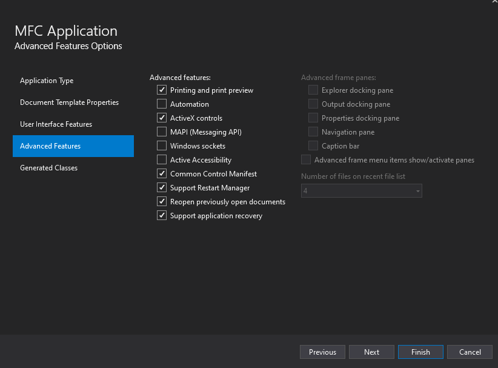
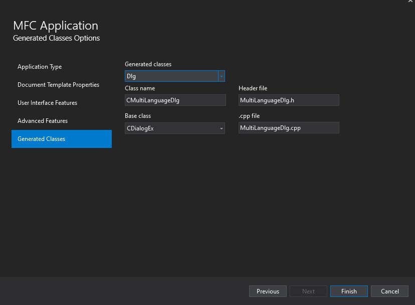
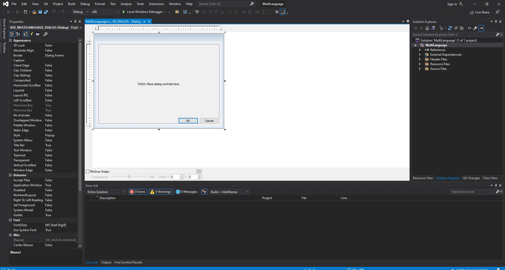
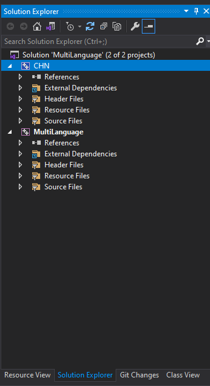
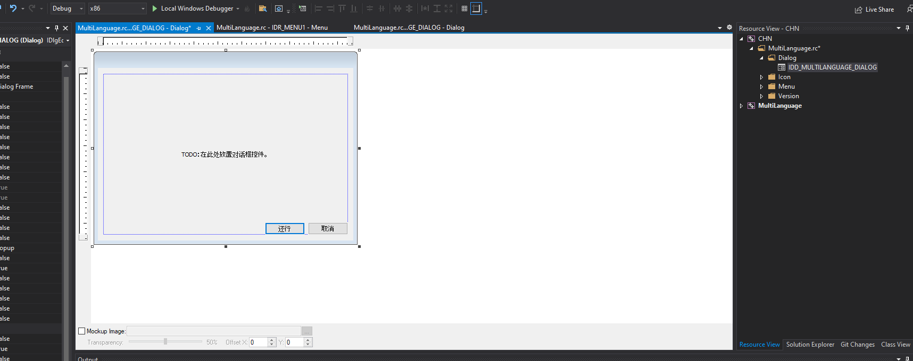

# How to Create MFC Multi-Language Support application

First, create an `MFC app` ` dialog-based` project.
Follow the steps shown in the `1-7` images then click finish. 

 
`                                               fig: Image 1                                              `
   

 
`                                               fig: Image 2                                              `

   

 
`                                               fig: Image 3                                              `

   

 

`                                               fig: Image 4                                              `

   

 

`                                               fig: Image 5                                              `

   

 

`                                               fig: Image 6                                              `

   

 

`                                               fig: Image 7                                              `

A project like the image of `figure- 8` will be created.

 

`                                               fig: Image 8                                              `

Currently, all the resources are in English version, Now we will create the Chinese version of it. Do The following steps:

	solution -> right click -> Add -> New Project -> MFC DLL -> give project name(In my case I choose CHN) -> Ok

Now the solution explorer will look like this - `figure 9`
 

 

`                                               fig: Image 9                                              `

Now remove `CHN.rc` and `CHN.rc2` from `resource file`. then remove `resource.h` from `header file` of CHN.(delete completely)

go to `x:\x\x\MultiLanguage\MultiLanguage` folder. Copy `MultiLanguage.rc` and `resource.h` and paste them inside `x:\x\MultiLanguage\CHN` folder.

Now go to `x:\x\MultiLanguage\MultiLanguage\res` folder and copy all the files and then paste them inside `x:\x\MultiLanguage\CHN\res` folder.

Now add all the copied files inside the `CHN` folder. To add right click on CHN then `add -> existing item` 

Now open the resource of the CHN project and translate the text into Chinese (I use Google Translate to translate). Figure 10 shows a resource after translating the text inside it.
 

 

`                                               fig: Image 10                                              `

Modify the properties of the CHN project `[Configuration properties] -> [linker] -> [Advanced] -> "No Entry Point" is changed to "Yes(/NOENTRY)"` - figure 16

Right-click on `CHN` Then `Project only -> build only CHN` ==> This will create CHN.dll inside `x:\x\x\MultiLanguage\Debug\CNH.dll`

Now add a HINSTANCE type variavle inside `MultiLanguage.h`

	[HINSTANCE m_hLangDll;]

then go inside MultiLanguage.cpp  and inside function `BOOL CMultiLanguageApp::InitInstance(){}` write this part of the code. This part of the code will load the Chinese language instead of English.

	m_hLangDll = ::LoadLibraryA("CHN.dll");
	if (m_hLangDll != NULL) {
		AfxSetResourceHandle(m_hLangDll);
	}
	else {
		TRACE("\ncan't load chinise\n");
	}
 

This code will load the Chinese language instead of the English language. Now you can use the if else condition as you want to control different languages. Create different dll for different languages and add logic when to load which dll.

